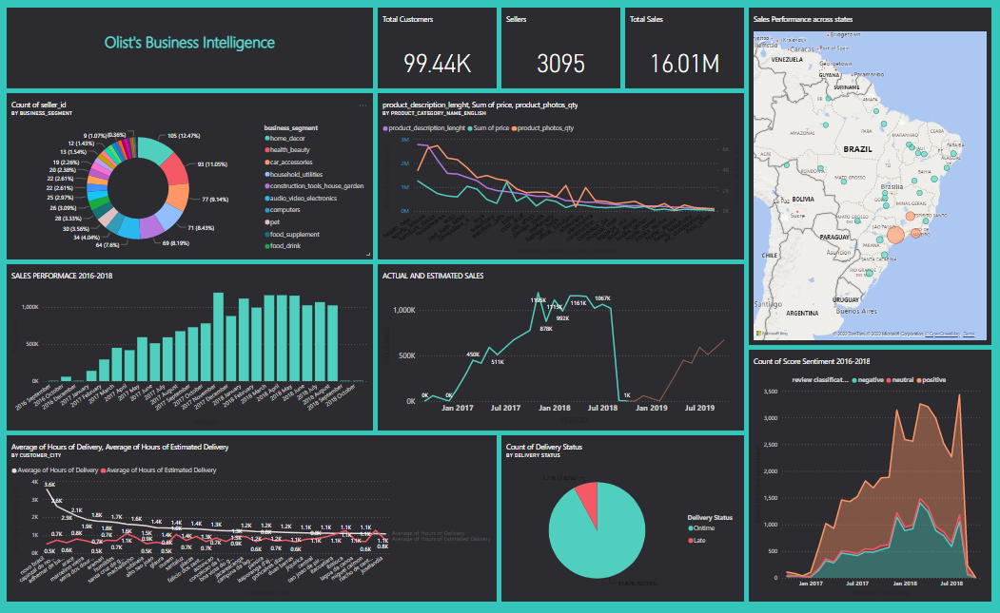

# PowerBI-Dashboard-Olist-e-commerce-data
**A project on building PowerBI dashboard using Olist Brazilian e-commerce Dataset**

Olist Store is the largest department store in Brazilian marketplaces. Olist connects small businesses from all over Brazil to channels without hassle and with a single contract. The Brazilian eCommerce public dataset of orders (from 2016 to 2018) made at Olist Store has been provided  for analysis.

Project is based on the dataset provided by 	[Olist](https://www.kaggle.com/datasets/olistbr/brazilian-ecommerce)

using  PowerBI desktop and PowerBI service,  need to prepare a PowerBI dashboard with visualisations that answer key questions, as well as prepare and present a final report.

Visualise a company’s customer demographics, sales trend, orders by categories, orders changes by year, etc.

Utilise created visualisations to provide recommendations for improvements

Here is the final dashboard

